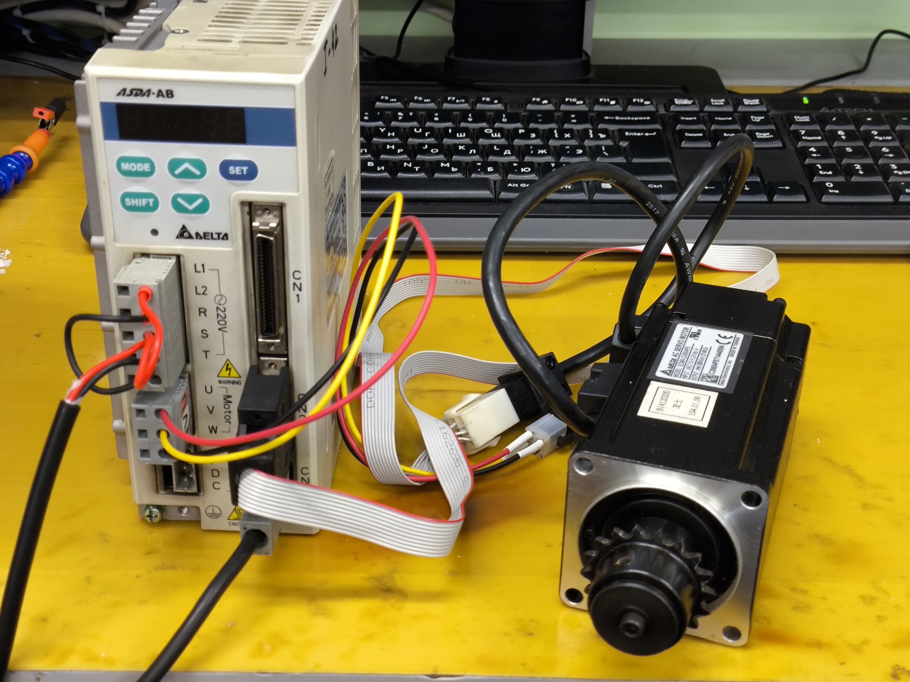
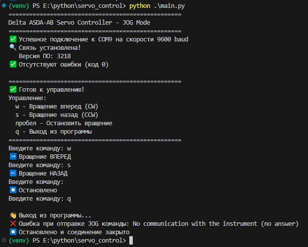

# Delta ASDA-AB Servo Control


Скрипт для управления сервоприводом **Delta ASDA-AB** (ASD-A0421-AB) через протокол **Modbus RTU** по интерфейсу **RS-485** с возможностью управления в режиме **JOG**.

## 🚀 Возможности
- ✅ Проверка связи с сервоприводом по Modbus RTU (чтение версии прошивки VER)
- 🔍 Проверка наличия ошибок на сервоприводе (код ошибки ALE)
- ⚙️ Управление вращением мотора в режиме JOG:
  - ➡️ Вперед (CW) - клавиша w
  - ⬅️ Назад (CCW) - клавиша s
  - ⏹️ Остановка - клавиша пробел
  - 🔼 Увеличение скорости на 25 об/мин - клавиша +
  - 🔽 Уменьшение скорости на 25 об/мин - клавиша -
- 🚪 Выход из программы - клавиша q
- 💾 Сохранение и чтение текущей скорости при запуске/выходе

## 📂 Структура файлов
```bash
├── servo_control.py        # Основной скрипт управления
├── modbus_config.yaml      # Файл конфигурации Modbus
├── requirements.txt        # Зависимости Python
└── README.md               # Эта документация
```

## 🖼️ Внешний вид стенда



## ⚙️ Требования к настройке сервопривода
Перед запуском скрипта необходимо выполнить следующие настройки через панель управления привода.

### 🔁 Сброс параметров сервопривода::
- `P2-51` = `0` (отключаем автоматическое включение **Servo ON** при подаче питания);
- Перезагружаем привод снятием питания на 15..20 секунд;
- `P2-08` = `10` (Сброс параметров на заводские значения);
- Перезагружаем привод снятием питания на 15..20 секунд.

### 🛠️ Настройка сервопривода:
- `P3-00` = `1` адрес устройства;
- `P3-01` = `1` скорость **9600** bps;
- `P3-02` = `7` **Modbus RTU**, **8**,**E**,**1**;
- `P3-05` = `2` Установка использования связи **RS-485**;
- `P2-51` = `1` автоматическое включение **Servo ON** при подаче питания;
- `P2-15`, `P2-16`, `P2-17` = `0` предельные выключатели **CWL**, **CCWL** и аварийная кнопка **EMGS** отключены4;
- Перезагружаем привод снятием питания на 15..20 секунд.

### 🧪 Процедура проверки
- Осуществите пробный пуск без нагрузки в режиме **«JOG»** (раздел 5.3 "ASDA-AB. Руководство пользователя");
- Проверьте подключение к сервоприводу посредством специального ПО ASDA Soft V4.08.09;

## 📦 Установка зависимостей
```bash
pip install -r requirements.txt
```

## ⚙️ Файл конфигурации
Пример файла `modbus_config.yaml`:
```yaml
# Конфигурация Modbus RTU для сервопривода Delta ASDA-AB
modbus:
  port: "COM9"       # COM-порт (Windows) или /dev/ttyUSB0 (Linux)
  baudrate: 9600     # Скорость передачи данных
  bytesize: 8        # Количество бит данных
  parity: "E"        # Четный паритет (Even)
  stopbits: 1        # Количество стоп-бит
  timeout: 1.0       # Таймаут ответа в секундах
  slave_address: 1   # Адрес устройства (P3-00)
```

## ▶️ Запуск программы
```bash
python servo_control.py
```

## 🔄 Принцип работы
1. Скрипт устанавливает соединение с сервоприводом через указанный **COM-порт**;
2. Проверяется связь путем чтения версии прошивки (параметр `P0-00`);
3. Проверяется наличие ошибок (параметр `P0-01`) - если их нет, пользователь получает соответствующее уведомление;
4. Выводится меню управления:
    ```bash
    ✅ Готов к управлению!
    Управление:
    w - Вращение вперед (CW)
    s - Вращение назад (CCW)
    пробел - Остановить вращение
    q - Выход из программы
    ```
5. Программа ожидает команды от пользователя, вводимой через консоль.
  

## 🧩 Особенности реализации
- ⌨️ Используется стандартная блокирующая обработка ввода через функцию `input()`;
- 🔧 Полная обработка кодов ошибок с выводом справочной информации;
- ⏹️ Автоматическая остановка вращения и сброс скорости до начального значения перед выходом из программы;
- 📡 Чтение текущей скорости при запуске скрипта для синхронизации с сервоприводом;
- 🔄 Изменение скорости "на лету" без необходимости останавливать мотор;
- 🧩 Поддержка различных типов сервоприводов через конфигурационный файл;
- 🧱 Упрощенная архитектура для легкого расширения функционала.

## ⚠️ Безопасность
- 🔌 Перед подключением устройства убедитесь, что все параметры настроены правильно;
- 🐢 Для начальной проверки работы используйте низкую скорость **JOG** (50-100 об/мин);
- 🔒 Убедитесь в надежном закреплении мотора перед запуском;
- 🔌 Проверьте правильность подключения **RS-485**: A(+) и B(-) линии;
- 👀 Не оставляйте работающий мотор без присмотра!
